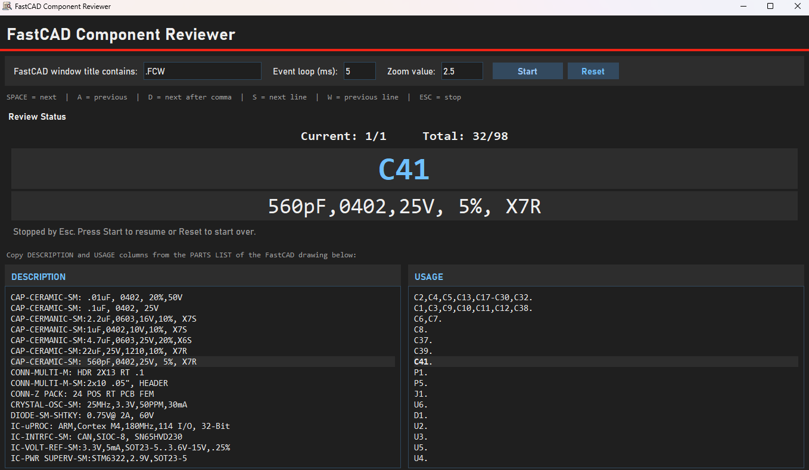
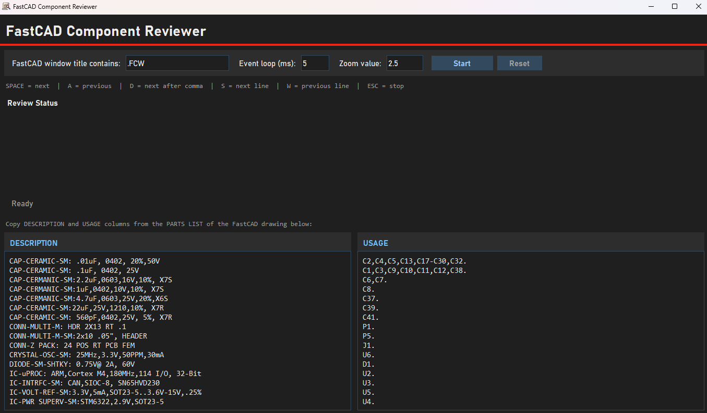

# FastCAD Component Reviewer

A lightweight Windows helper app to review placement designators in FastCAD.

## Screenshots

### Main App Running



### FastCAD In View


### Reviewer Stopped/Off State



## What it does

- Lets you paste description lines and placement-designator lines.
- Expands designator ranges such as `C65-C128` into individual components.
- Shows current review progress (`current/total`), current component, and current description.
- Lets you configure the zoom value sent after `ZOUT` (default `2.5`).
- Global controls while running:
  - `Space`: next component
  - `D`: next component after comma
  - `S`: next line
  - `Esc`: stop and preserve your place
- The `Start` button becomes `Stop (Esc)` while reviewing.
- Pressing `Stop (Esc)` preserves the current review state so `Start` can resume.
- Press `Reset` to clear the saved review state and start over.
- On each move, it activates the FastCAD window and sends:
  - `Esc`
  - `ztext`
  - Enter
  - component designator (example: `C01`)
  - Enter
  - `ZOUT`
  - Enter
  - configured zoom value (default `2.5`)
  - Enter
- If FastCAD shows a "multiple matches" dialog after `ztext`, the app waits for you to click the correct result first.
  `ZOUT` and the configured zoom value are sent automatically only after that dialog closes.
- If no chooser dialog appears, the app still waits for FastCAD to resolve the selection before sending `ZOUT`.

## Setup

1. Open a terminal in this folder.
2. Create and activate a virtual environment (recommended):

```powershell
python -m venv .venv
.\.venv\Scripts\Activate.ps1
```

3. Install dependencies:

```powershell
pip install -r requirements.txt
```

## Run

```powershell
python main.py
```

Or double-click `run_app.bat`.

## Build EXE (Standalone)

```powershell
./build_exe.ps1
```

Output:

- `dist/FastCAD-Component-Reviewer.exe`

## Input format

- Paste one description per line in the left box.
- Paste one matching designator line per line in the right box.
- The app pairs line 1 with line 1, line 2 with line 2, and so on.
- If counts differ, it uses the shortest matching pair count.

## Notes

- The app uses global keyboard hooks, so run with permissions that allow keyboard capture.
- FastCAD activation uses a title substring match; adjust the "FastCAD window title contains" field if needed.
- Delay between command text and component entry is currently `0.01` seconds.
- PyAutoGUI failsafe is enabled: move the mouse to the top-left corner quickly to trigger failsafe if needed.
- When launched with `python main.py`, Windows may show the Python icon in the taskbar; launch `dist/FastCADreviewer.exe` to use the app icon.
